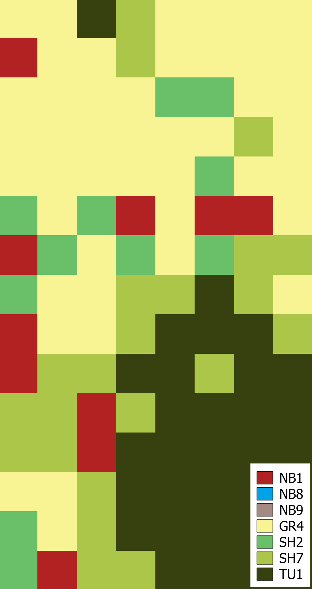
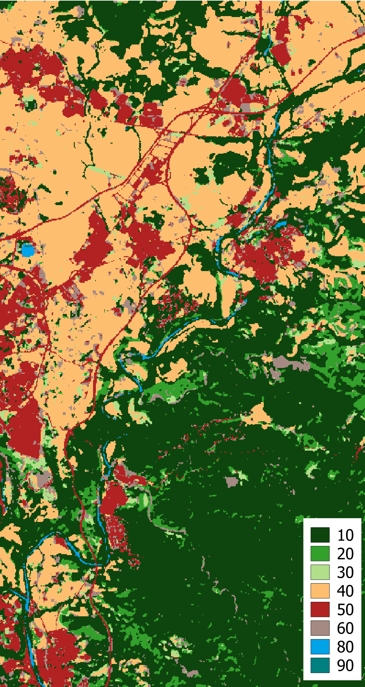
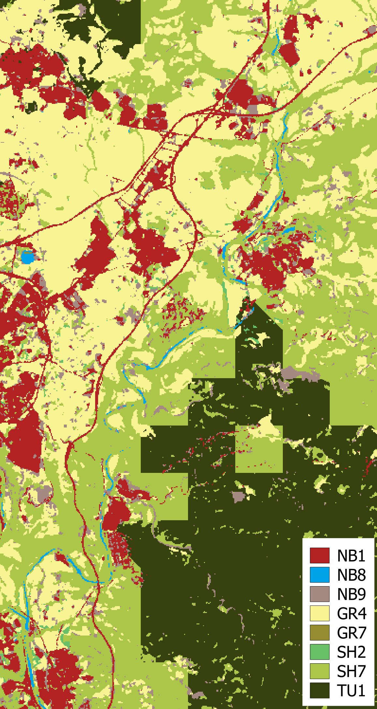

This code is © P. Sánchez, 2025, and it is made available under the **GPL license** enclosed with the software.

If you publish results using our **ZAFM algorithm**, please acknowledge our work by citing the software directly as:

> Sánchez, P., González, I., Carrillo, C. et al. *Zone adaptive fuel mapping for high resolution wildfire spread forecasting.* **Sci Rep** 15, 22254 (2025).  
> https://doi.org/10.1038/s41598-025-06402-1

This work is part of the project **CPP2021-008762** and has been financed by MCIN/AEI/10.13039/501100011033 and the European Union *NextGenerationEU*/PRTR.

# ZAFM  

This repository proposes an automatic methodology for generating high-resolution fuel maps from land cover maps, called **Zone-Adaptive Fuel Mapping (ZAFM)**.  
ZAFM is a consistent local approach that leverages publicly available resources to create fuel maps.  
The methodology is described in the article *Zone adaptive fuel mapping for high-resolution wildfire spread forecasting* (DOI: [10.1038/s41598-025-06402-1](https://doi.org/10.1038/s41598-025-06402-1)).

To apply this methodology, two maps are required:  
1. A **high-resolution land cover map** of the study area.  
2. A **low-resolution reference fuel map** of the same area, used to identify the fuel models present in the region.  

Additionally, a **Land cover to fuel model table** is required, where each land cover type is associated with one or multiple fuel models. If multiple fuel models are possible, the ZAFM methodology assigns a single final fuel model to each land cover cell.  

This code demonstrates the methodology applied to generate a high-resolution fuel map for an **Extreme Wildfire Event (EWE)** that occurred in north-eastern Spain during the summer of 2022 (*El Pont de Vilomara*).  

---

## Input Data  

We used:  
- **WorldCover 2021 (WCM)** as the land cover map.  
- **Scott and Burgan fire behaviour fuel model classification (FBFM40)** as the fuel model set.  
- **European FirEUrisk fuel map** (1 km resolution) as the reference fuel map, based on FBFM40.  

The maps used in this case study are included in `data/raw`:  
- `Fireurisk_raw.tif`  
- `Worldcover_raw.tif`  

Both are pre-processed (clipped and reprojected) for the *El Pont de Vilomara* area. They can be downloaded and processed for other study regions:  

- **Fireurisk_raw.tif** → [Dataset link](https://edatos.consorciomadrono.es/dataset.xhtml?persistentId=doi:10.21950/YABYCN)  
  > Aragoneses, E., Garcia, M., & Chuvieco, E. (2022). *FirEUrisk_Europe_fuel_map: European fuel map at 1 km resolution*. [DOI: 10.21950/YABYCN](https://doi.org/10.21950/YABYCN).  

- **Worldcover_raw.tif** → [Dataset link](https://worldcover2021.esa.int/downloader)  
  > Zanaga, D., Van De Kerchove, R., Daems, D., De Keersmaecker, W., Brockmann, C., Kirches, G., Wevers, J., Cartus, O., Santoro, M., Fritz, S., Lesiv, M., Herold, M., Tsendbazar, N.E., Xu, P., Ramoino, F., Arino, O. (2022). *ESA WorldCover 10 m 2021 v200*. [DOI: 10.5281/zenodo.7254221](https://doi.org/10.5281/zenodo.7254221).  

The output is a **20 m resolution fuel map**.  

---

## Homogenization  

Both input maps are already in the same projection (EPSG:3035).  
We work with `.asc` format maps.  

The downloadable FirEUrisk map uses *fireurisk classes* instead of fuel models. To convert them into Burgan’s fuel models, the climate regime must be considered (arid/semi-arid vs. humid/sub-humid).  

Steps:  
1. **Resampling to 20m x 20m resolution** (to match the resolution required for LCP simulations).  
   - Downscaling: *mode* → assigns the most frequent class within each new cell.  
   - Upscaling: *nearest neighbour* → replicates the original value.  

2. **Alignment** of both maps by computing their overlap and forcing the same grid size and resolution.  

In the scientific article (DOI above), homogenization was performed with GDAL commands, but here it is implemented directly in **Python** for an easier of execution.  

---

## Land Cover to Fuel Model Table  

This table is provided in `data/raw`. It assigns each land cover category to all possible class-to-fuel combinations:  
- **Direct assignments** → single land cover to fuel model.  
- **Multiple assignments** → ZAFM chooses a unique model during execution.  

WCM class `40` (*croplands*) is assigned directly to fuel model `104`, assuming crops are planted. In another work (*Remote Sensing AI for Crop Planting in Wildfire Fuel Mapping*, DOI: [10.1007/978-3-031-97635-3_8](https://doi.org/10.1007/978-3-031-97635-3_8)), we explore classification of croplands depending on planting conditions at the time of the fire.  

---

## Algorithm (ZAFM)  

The ZAFM algorithm assigns a fuel model to every cell in the final map.  
- If multiple models are possible for a land cover class, the algorithm selects the most suitable one based on **Euclidean distance (in pixels)** as the selection criterion.  

The following figures show the final map obtained by applying ZAFM to the case study, along with the two input maps used:

<table>
  <tr>
    <th>Fireurisk</th>
    <th>WCM</th>
    <th>ZAFM</th>
  </tr>
  <tr>
    <td></td>
    <td></td>
    <td></td>
  </tr>
</table>
---

## Global Implementation  

To apply ZAFM elsewhere in Europe:  
1. Download, clip, and reproject **FirEUrisk** and **WorldCover 2021** maps (links in *Input Data*).  
2. Build a custom **land cover to fuel model conversion table** (see `data/raw/LC_to_FM.json`).  
3. Convert FirEUrisk classes into fuel models by specifying the **climate regime** in `main.py`:  
   - `"arid"` → arid/semi-arid regions.  
   - `"humid"` → humid/sub-humid regions.  
   > See Figure B1 in Aragoneses, E., García, M., Salis, M., Ribeiro, L. M., & Chuvieco, E. (2023). *Classification and mapping of European fuels using a hierarchical, multipurpose fuel classification system*. Earth Syst. Sci. Data, 15, 1287–1315. [DOI: 10.5194/essd-15-1287-2023](https://doi.org/10.5194/essd-15-1287-2023).  

---

## Funding  

This work is part of project **CPP2021-008762** and has been financed by **MCIN/AEI/10.13039/501100011033** and the **European Union–NextGenerationEU/PRTR**.  

It was also funded by:  
- The Spanish Ministry of Science and Innovation (contracts PID2020-113614RB-C21, PID2023-146193OB-I00).  
- The Catalan Government under grant **2021 SGR-00574**.  

