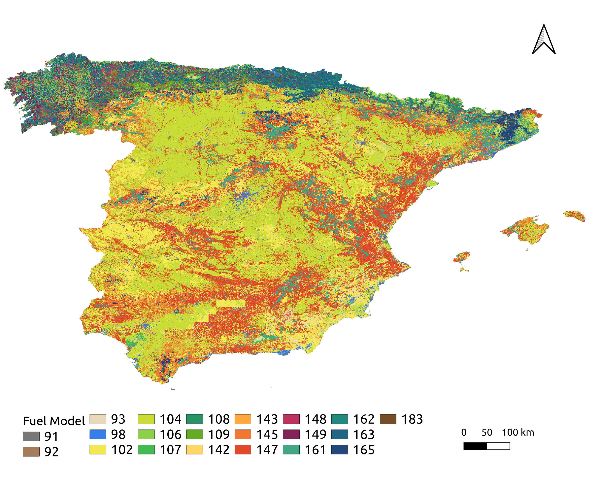
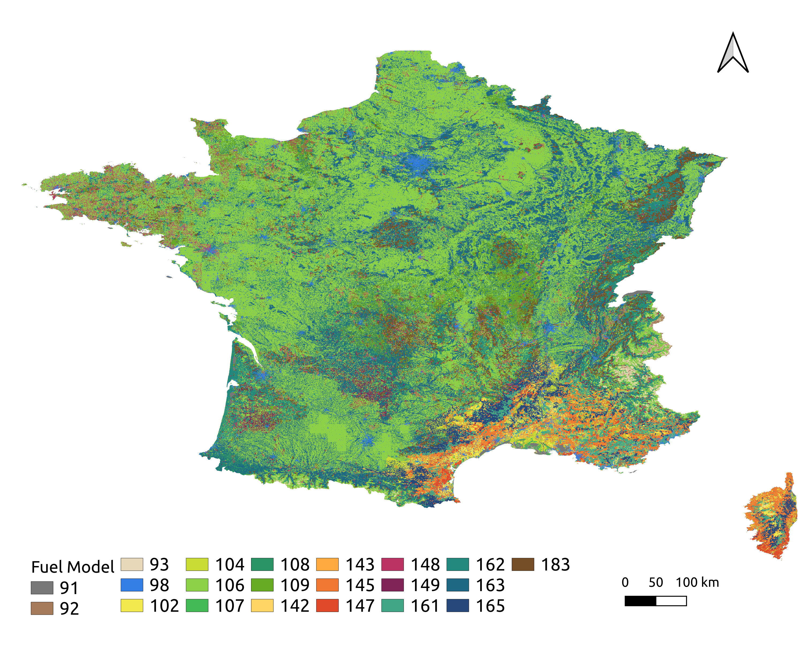
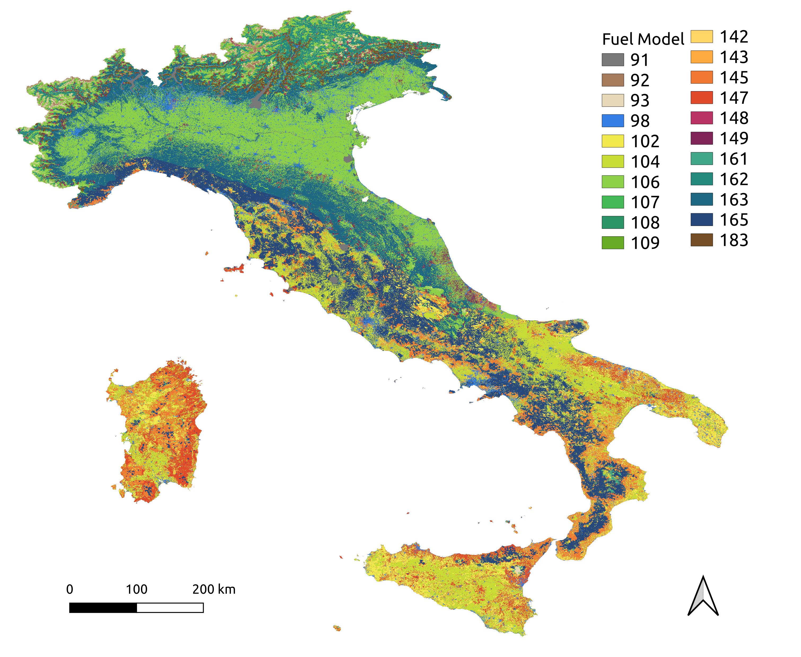
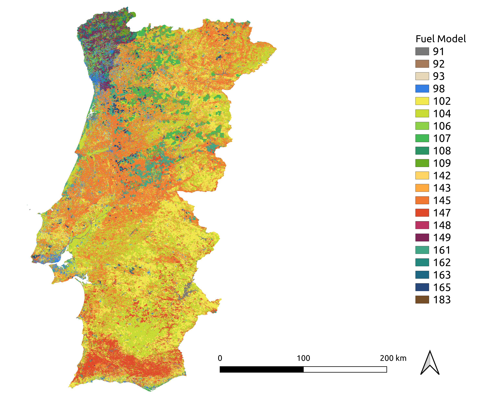
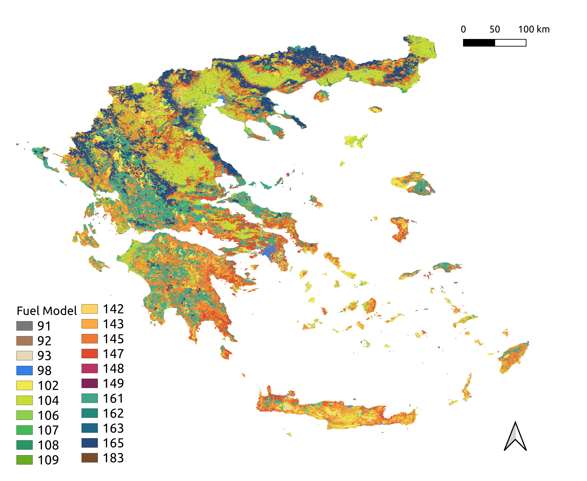

This code is © P. Sánchez, 2025, and it is made available under the **GPL license** enclosed with the software.

If you publish results using our **ZAFM algorithm**, please acknowledge our work by citing the software directly as:

> Sánchez, P., González, I., Carrillo, C. et al. *Zone adaptive fuel mapping for high resolution wildfire spread forecasting.* **Sci Rep** 15, 22254 (2025).  
> https://doi.org/10.1038/s41598-025-06402-1

This work is part of the project **CPP2021-008762** and has been financed by MCIN/AEI/10.13039/501100011033 and the European Union *NextGenerationEU*/PRTR.


# ZAFM (Zone-Adaptive Fuel Mapping) — v2 (bioclim + large areas)

This repository contains **two versions** of the code:

- **v2 (current)**: designed for **large-area maps** (Spain, France, Italy, Portugal, Greece, …), incorporating a **bioclimatic regime (humid vs. arid)** and a **tile-optimized** algorithm.
- **v1 (legacy)**: the original version of the repository (the one previously on `main`), preserved **as-is** in `legacy/v1/`.

## Large input data (not included)
Due to **size and licensing restrictions**, the input GeoTIFF datasets are **not included** in this repository.

Users must download:
- **ESA WorldCover 2021 (10 m)**  
- **FirEUrisk European fuel map (1 km)**

and preprocess them using the scripts in `scripts/preprocess/` (see below).

## What does ZAFM do?
ZAFM produces a **high-resolution fuel model map** by fusing:

1) A **land-cover** map (here: WCM / ESA WorldCover)  
2) A **reference fuel map** (here: **FirEUrisk**)  
3) A set of mapping rules (lookup tables)  

When a land-cover class admits **multiple candidate fuel models**, ZAFM assigns the one that is **spatially most consistent** with the reference fuel map using a proximity-based criterion.

## What’s new in v2
- **Bioclimatic regime**: the FirEUrisk → Burgan conversion uses **two dictionaries** (humid / arid), selected via a raster mask created from a shapefile (`data/bioclim/humid.shp`).
- **Performance optimization**: processing by **tiles + halo** and distance computation with `scipy.ndimage.distance_transform_edt` (avoids pixel-by-pixel loops).
- **Multi-region support**: batch execution for multiple region/prefix codes.

## Repository structure
```
.
├─ src/zafm/                  # v2 implementation (Python package)
├─ scripts/
│  ├─ run_zafm.py             # CLI (single region or batch)
│  └─ preprocess/             # data preparation helpers (WCM/FirEUrisk alignment)
├─ data/
│  ├─ input/                  # (not versioned) large input GeoTIFFs
│  └─ bioclim/                # humid.shp shapefile (example)
├─ output/                    # outputs (not versioned)
├─ media/                     # figures / media
└─ legacy/v1/                 # original version of the repo
```

## Requirements & installation

### Option A — conda (recommended)
```bash
conda env create -f environment.yml
conda activate zafm
```

### Option B — pip
```bash
pip install -e .
```

> Note: `geopandas` may require additional system dependencies on some platforms.

## Preprocessing workflow (WCM + FirEUrisk alignment)

### Step 1 — Clip WorldCover (WCM) to your region
You must first create a **WCM ROI raster** for your study area (e.g., using QGIS, GDAL, or your own scripts).  
The rest of the pipeline assumes you have a file like:

- `<REG>__WCM_4326_clip.tif`

### Step 2 — Align FirEUrisk to the exact WCM grid (nearest neighbour “cell replication”)
Use `scripts/preprocess/align_fire_to_wcm.py` to resample/reproject FirEUrisk onto the **exact** grid of your WCM ROI
(CRS/transform/width/height). Nearest neighbour ensures categorical values are preserved and effectively performs the
“cell replication” needed when upsampling from 1 km to 10 m.

```bash
python scripts/preprocess/align_fire_to_wcm.py   --wcm  data/input/<REG>__WCM_4326_clip.tif   --fire data/input/fireurisk_4326.tif   --out  data/input/<REG>__FIREURISK_4326_clip_aligned_to_WCM.tif
```

### Step 3 — Fix invalid placeholder/negative values (if present)
Some FirEUrisk rasters use a sentinel value (e.g., `-32768`). Replace it with a proper nodata (default `-9999`):

```bash
python scripts/preprocess/fix_fire_values.py   --in  data/input/<REG>__FIREURISK_4326_clip_aligned_to_WCM.tif   --out data/input/<REG>__FIREURISK_4326_clip_aligned_to_WCM_fix.tif
```

> If your aligned raster does not contain such values, you can skip this step.

### Step 4 — Mask outside the domain (recommended)
ZAFM expects FirEUrisk to be **masked outside the study area** (nodata outside).  
If your workflow already produces a masked file (e.g., `..._MASKED.tif`), use that as input to ZAFM.

## Expected inputs (ZAFM v2)
In `data/input/` (or the directory you provide), ZAFM expects per region:

- `<REG>__WCM_4326_clip.tif`
- `<REG>__FIREURISK_4326_clip_aligned_to_WCM_MASKED.tif` (or your fixed/masked variant)

Examples of `<REG>`: `ESP`, `FRA`, `GRC`, `ITA`, `PRT`.

**Important**
- WCM and FirEUrisk must be **perfectly aligned** (same CRS, transform, width/height).
- FirEUrisk should be **masked outside the study area** (nodata outside).
- By default, **WCM==0** is assumed to be “outside” the domain (nodata is written in the output).

## Usage

### 1) Run a single region (explicit paths)
```bash
python scripts/run_zafm.py   --wcm data/input/ESP__WCM_4326_clip.tif   --fire data/input/ESP__FIREURISK_4326_clip_aligned_to_WCM_MASKED.tif   --humid-shp data/bioclim/humid.shp   --out output/ESP_4326_ZAFM.tif
```

### 2) Run multiple regions (batch)
```bash
python scripts/run_zafm.py   --input-dir data/input   --regions ESP,FRA,GRC,ITA,PRT   --humid-shp data/bioclim/humid.shp   --out-dir output
```

### Useful parameters
- `--tile W,H` (default `2048,2048`)
- `--halo N` (default `256`)
- `--out-nodata V` (default `0`)
- `--outside-mask V` (default `0`, if WCM==0 means outside)

## Output
One GeoTIFF per region is produced:
- single band, `uint16`
- `LZW` compression
- `BIGTIFF=YES`

## Example maps

### Spain


### France


### Italy


### Portugal


### Greece


## Required input datasets and citation

### Reference fuel map
**FirEUrisk European fuel map (1 km resolution)**  
https://edatos.consorciomadrono.es/dataset.xhtml?persistentId=doi:10.21950/YABYCN

Aragoneses, E., Garcia, M., & Chuvieco, E. (2022).  
*FirEUrisk_Europe_fuel_map: European fuel map at 1 km resolution*.  
DOI: https://doi.org/10.21950/YABYCN

### Land-cover map
**ESA WorldCover 10 m 2021 v200**  
https://worldcover2021.esa.int/downloader

Zanaga, D., Van De Kerchove, R., Daems, D., De Keersmaecker, W., Brockmann, C., Kirches, G., Wevers, J., Cartus, O., Santoro, M., Fritz, S., Lesiv, M., Herold, M., Tsendbazar, N.E., Xu, P., Ramoino, F., Arino, O. (2022).  
*ESA WorldCover 10 m 2021 v200*.  
DOI: https://doi.org/10.5281/zenodo.7254221

If you use ZAFM or any derived products in a scientific publication, please cite **both datasets** in addition to this repository.

## Keeping the old version in GitHub (without losing anything)
Recommended safe workflow:

1) In your local repository, create a branch to freeze the old version:
```bash
git checkout main
git checkout -b legacy-v1
```

2) Switch back to `main` and add v2 as a new commit.

3) (Optional) Tag releases:
```bash
git tag -a v1.0.0 -m "ZAFM original (legacy)"
git tag -a v2.0.0 -m "ZAFM bioclim + tiles + multi-region"
git push --tags
```

## Legacy (v1)
The original version is available under `legacy/v1/` and is preserved without changes.

---
## Funding  

This work is part of project **CPP2021-008762** and has been financed by **MCIN/AEI/10.13039/501100011033** and the **European Union–NextGenerationEU/PRTR**.  

It was also funded by:  
- The Spanish Ministry of Science and Innovation (contracts PID2020-113614RB-C21, PID2023-146193OB-I00).  
- The Catalan Government under grant **2021 SGR-00574**.  
